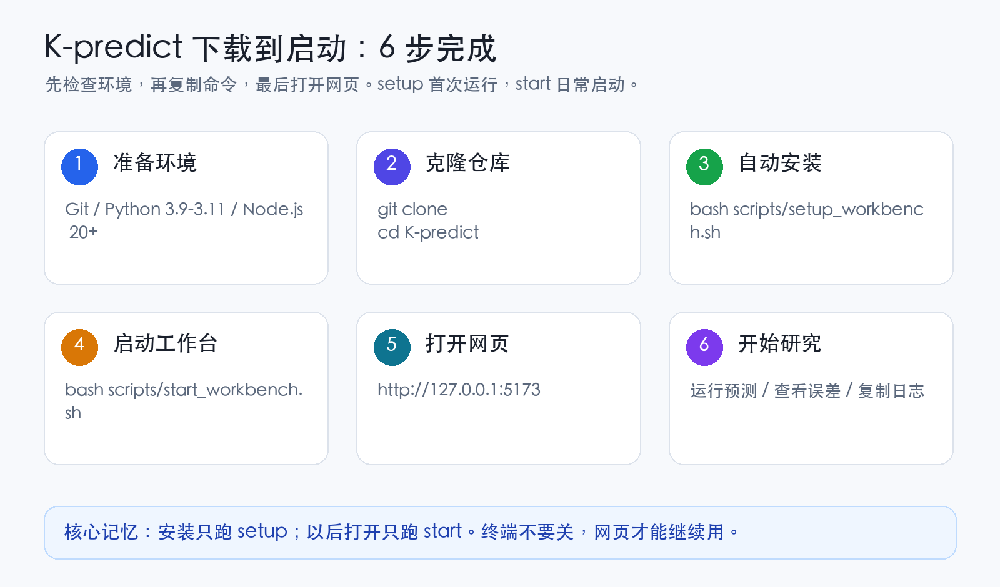
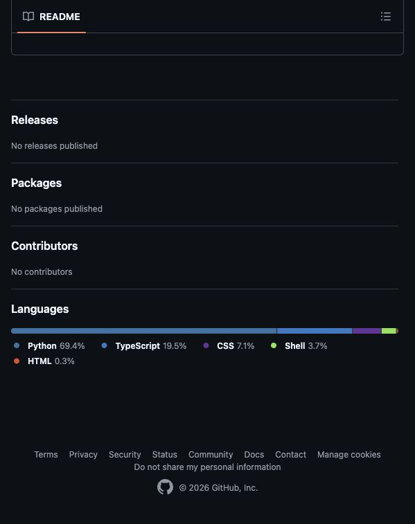
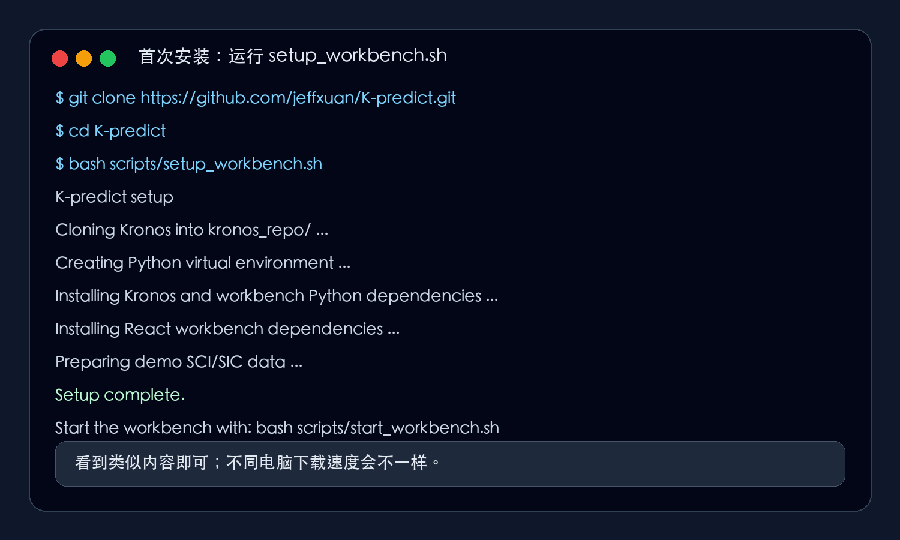
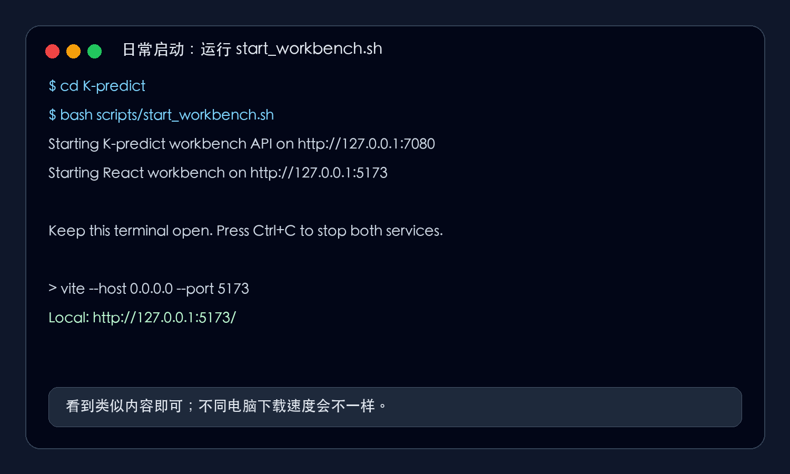
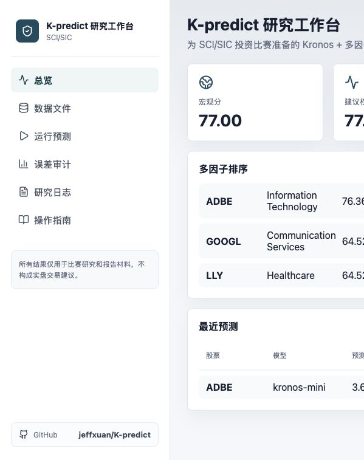
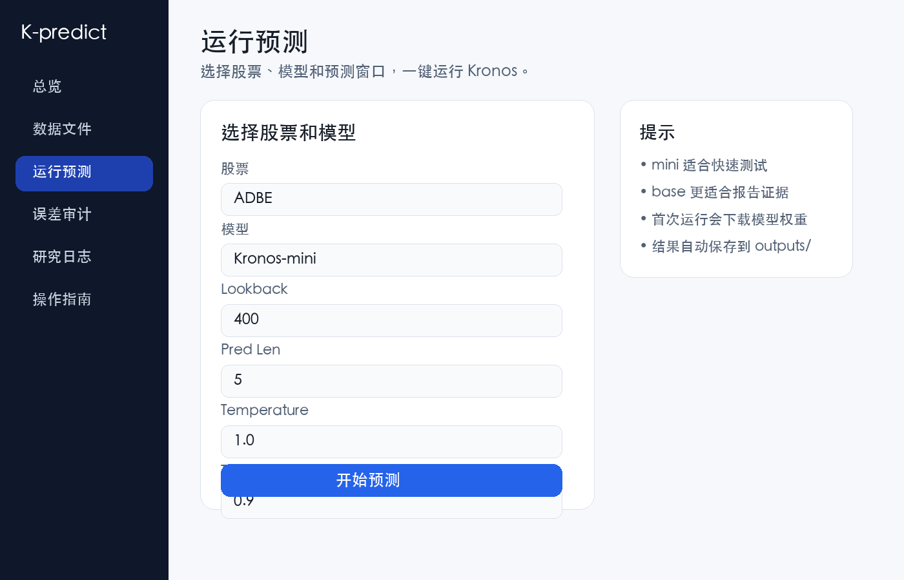
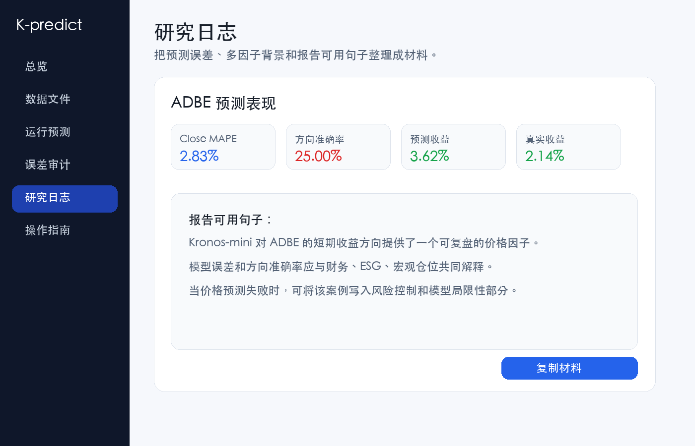

# K-predict 下载与启动指南

这份指南是给 SCI/SIC 投资比赛同学准备的。你不需要先理解 Kronos 或代码结构，只要按顺序复制命令，就可以在本地打开 K-predict 双语研究工作台。

GitHub 地址：[https://github.com/jeffxuan/K-predict](https://github.com/jeffxuan/K-predict)



## 0. 先确认电脑环境

Mac 用户建议先安装这三个工具：

| 工具 | 要求 | 检查命令 |
| --- | --- | --- |
| Git | 能访问 GitHub | `git --version` |
| Python | 3.9 到 3.11 | `python3 --version` |
| Node.js | 20 或更高 | `node --version` |

如果命令提示 `command not found`：

- Git：安装 Xcode Command Line Tools，终端运行 `xcode-select --install`
- Python：建议从 [python.org](https://www.python.org/downloads/) 安装 Python 3.11
- Node.js：建议从 [nodejs.org](https://nodejs.org/) 安装 LTS 版本

Windows 同学建议使用 Git Bash 或 PowerShell。命令基本相同，但如果 `bash scripts/...` 无法运行，请先安装 Git for Windows，并在 Git Bash 里执行。

## 1. 下载项目

打开终端，复制下面三行：

```bash
git clone https://github.com/jeffxuan/K-predict.git
cd K-predict
```

你也可以先在浏览器里打开 GitHub 页面确认仓库：



## 2. 首次安装

第一次使用只需要运行一次 setup：

```bash
bash scripts/setup_workbench.sh
```

它会自动完成这些事：

- 下载原始 Kronos 项目到 `kronos_repo/`
- 创建 Python 虚拟环境
- 安装 Kronos、Flask API 和 React 前端依赖
- 准备 ADBE、LLY、GOOGL 的示例数据

看到类似下面的内容就是正常的：



这一步可能比较慢，尤其是第一次安装 Python 依赖时。中途如果网络断开，重新运行同一条命令即可：

```bash
bash scripts/setup_workbench.sh
```

## 3. 启动工作台

安装完成后，运行：

```bash
bash scripts/start_workbench.sh
```

看到类似下面的内容后，不要关闭这个终端窗口：



然后打开浏览器访问：

```text
http://127.0.0.1:5173
```

成功后你会看到 K-predict 工作台：



## 4. 第一次怎么用

推荐同学按这个顺序试：

1. 进入 `Data Library` / `数据文件`，确认价格、财务、ESG、宏观和组合文件都存在。
2. 进入 `Run Prediction` / `运行预测`，选择 `ADBE + Kronos-mini + 400/5` 做一次快速测试。
3. 等预测完成后，进入 `Error Audit` / `误差审计` 查看 MAPE、方向准确率、预测收益和真实收益。
4. 进入 `Research Notes` / `研究日志`，复制可用于比赛报告的文字材料。





## 5. 重要提醒

- 第一次运行 Kronos 模型会从 Hugging Face 下载权重，等待几分钟是正常的。
- `Kronos-mini` 适合快速测试，`Kronos-base` 更适合做报告证据，但会更慢。
- 所有预测和误差记录会保存在本机 `outputs/` 目录，不会自动上传到 GitHub。
- 这个项目用于投资比赛研究和报告写作，不构成实盘交易建议。

## 6. 常见问题

### Python 版本不对

如果看到 `Python 3.9-3.11` 相关报错，请安装 Python 3.11。安装后重新运行：

```bash
python3 --version
bash scripts/setup_workbench.sh
```

### Node 版本不够

如果看到 `Node.js 20+ is required`，请安装 Node.js LTS。安装后检查：

```bash
node --version
npm --version
```

### 下载 Kronos 或模型很慢

这是网络问题，不是项目坏了。可以换网络后重新运行：

```bash
bash scripts/setup_workbench.sh
```

如果是第一次点预测时很慢，通常是在下载 Hugging Face 模型权重，等它完成即可。

### 端口被占用

如果浏览器打不开 `http://127.0.0.1:5173`，先回到终端按 `Ctrl+C` 停止，再重新运行：

```bash
bash scripts/start_workbench.sh
```

### setup 中断了怎么办

直接重新运行：

```bash
bash scripts/setup_workbench.sh
```

脚本会复用已经下载好的内容，不需要手动删除文件。

## 7. 发给同学的一句话版本

复制下面这段给同学：

```text
先安装 Git、Python 3.11、Node.js 20+。然后打开终端：

git clone https://github.com/jeffxuan/K-predict.git
cd K-predict
bash scripts/setup_workbench.sh
bash scripts/start_workbench.sh

最后浏览器打开 http://127.0.0.1:5173。终端不要关。
```
